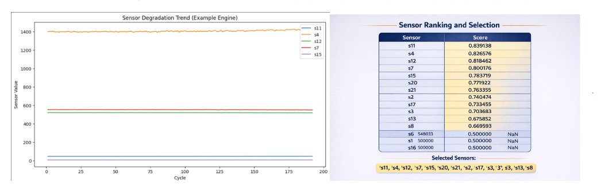

# 🚀 D7_MFC4_RUL Prediction

## ✈️ Attention-Based Remaining Useful Life (RUL) Prediction for Aircraft Turbofan Engines

---

# 📌 Project Title

**Attention-Based Remaining Useful Life Prediction for Aircraft Turbofan Engines using Deep Learning**

---

# 👥 Team Members

- **Poornima P** – cb.sc.u4aie24343  
- **Ch. Sarvani Sruthi** – cb.sc.u4aie24311  
- **Shri Manasa** – cb.sc.u4aie24356  
- **Sowmya A** – cb.sc.u4aie24357  

---

# 🎯 Objective

The objective of this project is to predict the **Remaining Useful Life (RUL)** of aircraft turbofan engines using **multivariate time-series sensor data**.

The aim is to enable **predictive maintenance** by estimating how long an engine can operate before failure. This helps to:

- Improve aircraft safety  
- Reduce unexpected downtime  
- Minimize maintenance costs  
- Optimize maintenance scheduling  

By analyzing degradation patterns in sensor data, the model predicts the **number of cycles remaining before engine failure**.

---

# 💡 Motivation / Why the Project is Interesting

Aircraft engine maintenance is highly critical and expensive. Traditional maintenance strategies either replace components **too early** or **too late**, which leads to increased operational costs or safety risks.

This project is interesting because it:

- Uses **real-world NASA engine degradation data**
- Applies **deep learning models to multivariate time-series sensor data**
- Learns degradation patterns automatically from sensor measurements
- Uses an **attention mechanism** to identify the most important degradation periods

---

# 🛠️ Methodology

---

# 📂 Dataset

The dataset used in this project is the **NASA C-MAPSS Turbofan Engine Dataset**.

The dataset contains **multivariate time-series sensor measurements** collected from aircraft engines operating under different conditions until failure.

Experiments are conducted on the following subsets:

- FD002  
- FD003  
- FD004  

Each dataset contains:

- Engine ID  
- Cycle number  
- Operational settings  
- Multiple sensor measurements  

Each row represents **one operating cycle of a specific engine**.

As the number of cycles increases, the engine gradually degrades until failure.

---

# 🔄 Data Preprocessing

## Normalization

Sensor values are normalized to ensure that all features lie within a similar numerical range.

The normalization formula used is:

$$
X_{norm} = \frac{X - X_{min}}{X_{max} - X_{min}}
$$

---

## Sliding Window Technique

The dataset is converted into **fixed-length sequences** using a sliding window approach.

Example:

Cycle 1–30 → Input Sequence 1  
Cycle 2–31 → Input Sequence 2  
Cycle 3–32 → Input Sequence 3  

This allows the model to learn **temporal degradation patterns**.

---

# 🧠 Model Architecture

The proposed deep learning architecture combines:

- CNN
- BiLSTM
- Attention Mechanism
- Dense Layer

Sensor Data → Sliding Window → CNN → BiLSTM → Attention → Dense Layer → RUL Prediction

---

# 1️⃣ Convolutional Neural Network (CNN)

A **1D CNN** extracts local temporal patterns from sensor sequences.

### Convolution Operation

$$
y(t) = \sum_{i=0}^{k} x(t-i) \cdot w(i)
$$

Where:

- $x(t)$ = input signal  
- $w(i)$ = filter weights  
- $k$ = kernel size  

CNN captures **local degradation features**.

---

# 2️⃣ Bidirectional Long Short-Term Memory (BiLSTM)

BiLSTM captures **long-term temporal dependencies**.

### Forget Gate

$$
f_t = \sigma(W_f [h_{t-1}, x_t] + b_f)
$$

### Input Gate

$$
i_t = \sigma(W_i [h_{t-1}, x_t] + b_i)
$$

### Candidate Memory

$$
\tilde{C_t} = tanh(W_c[h_{t-1}, x_t] + b_c)
$$

### Memory Update

$$
C_t = f_t \cdot C_{t-1} + i_t \cdot \tilde{C_t}
$$

### Output Gate

$$
o_t = \sigma(W_o [h_{t-1}, x_t] + b_o)
$$

### Hidden State

$$
h_t = o_t \cdot tanh(C_t)
$$

---

# 3️⃣ Attention Mechanism

### Alignment Score

$$
e_t = v^T tanh(W_h h_t + b)
$$

### Attention Weights

$$
\alpha_t = \frac{exp(e_t)}{\sum exp(e_i)}
$$

### Context Vector

$$
c = \sum \alpha_t h_t
$$

---

# 4️⃣ Fully Connected Layer

Final RUL prediction:

$$
RUL = Wc + b
$$

---

# 📊 Results

Evaluation Metrics:

- RMSE
- MAE
- R² Score

The model successfully captures degradation patterns and predicts engine Remaining Useful Life.

---

# 🔮 Future Work

- Real aircraft deployment
- Industrial machine monitoring
- Battery health prediction
- Robust models for noisy environments

---

# 📚 References

NASA Prognostics Data Repository  
https://ti.arc.nasa.gov/tech/dash/groups/pcoe/prognostic-data-repository/

International Journal of Prognostics and Health Management  
https://www.phmpapers.org

Scientific Reports – Springer Nature  
https://www.nature.com
