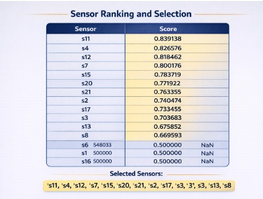
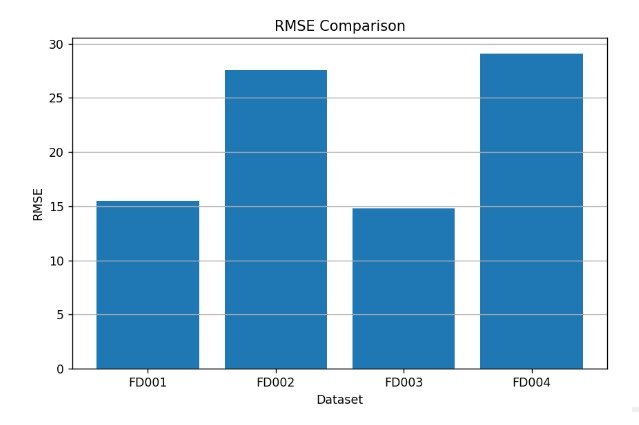
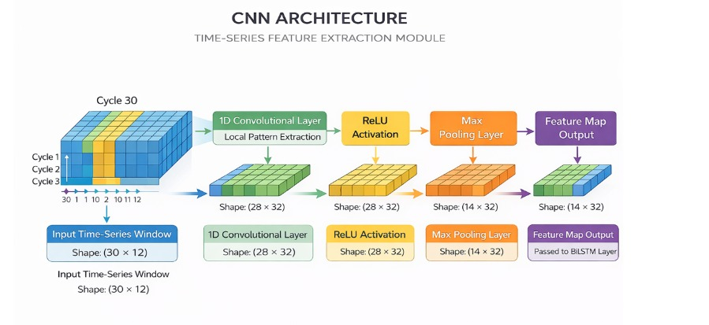
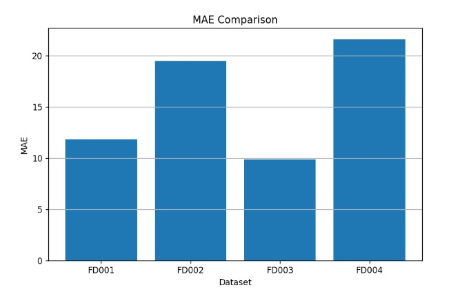
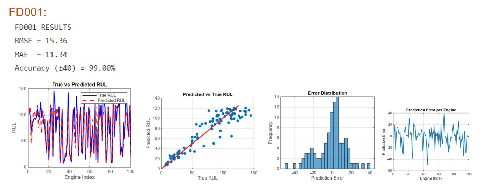
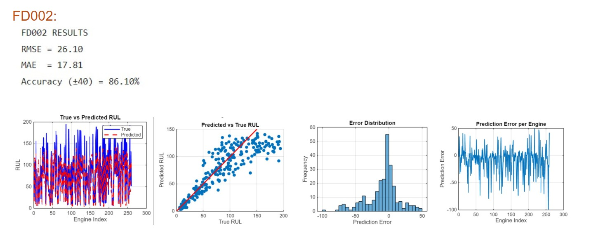
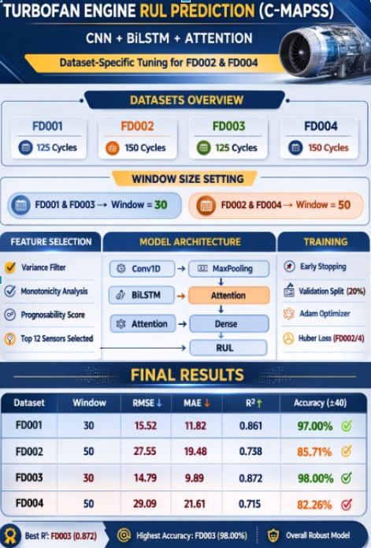

# 🚀 D7_MFC4_RUL Prediction

## ✈️ Attention-Based Remaining Useful Life (RUL) Prediction for Aircraft Turbofan Engines

---

# 📌 Project Title

**Attention-Based Remaining Useful Life Prediction for Aircraft Turbofan Engines using Deep Learning**

---

# 👥 Team Members

- **Poornima P** – cb.sc.u4aie24343  
- **Ch. Sarvani Sruthi** – cb.sc.u4aie24311  
- **Shri Manasa** – cb.sc.u4aie24356  
- **Sowmya A** – cb.sc.u4aie24357  

---

# 🎯 Objective

The objective of this project is to predict the **Remaining Useful Life (RUL)** of aircraft turbofan engines using **multivariate time-series sensor data**.

The aim is to enable **predictive maintenance** by estimating how long an engine can operate before failure. This helps to:

- Improve aircraft safety  
- Reduce unexpected downtime  
- Minimize maintenance costs  
- Optimize maintenance scheduling  

By analyzing degradation patterns in sensor data, the model predicts the **number of cycles remaining before engine failure**.

---

# 💡 Motivation / Why the Project is Interesting

Aircraft engine maintenance is highly critical and expensive. Traditional maintenance strategies either replace components **too early** or **too late**, which leads to increased operational costs or safety risks.

This project is interesting because it:

- Uses **real-world NASA engine degradation data**
- Applies **deep learning models to multivariate time-series sensor data**
- Learns degradation patterns automatically from sensor measurements
- Uses an **attention mechanism** to identify the most important degradation periods

By learning degradation behaviour directly from the data, the system can predict engine failure in advance and support **predictive maintenance strategies**.

---

# 🛠️ Methodology

---

# 📂 Dataset

The dataset used in this project is the **NASA C-MAPSS Turbofan Engine Dataset**.

The dataset contains **multivariate time-series sensor measurements** collected from aircraft engines operating under different conditions until failure.

Experiments are conducted on the following subsets:

- FD002  
- FD003  
- FD004  

Each dataset contains:

- Engine ID  
- Cycle number  
- Operational settings  
- Multiple sensor measurements  

Each row represents **one operating cycle of a specific engine**.

As the number of cycles increases, the engine gradually degrades until failure.

---

# 🔄 Data Preprocessing

## Normalization

Sensor values are normalized to ensure that all features lie within a similar numerical range.

The normalization formula used is:

$$
X_{norm} = \frac{X - X_{min}}{X_{max} - X_{min}}
$$

This ensures stable training and prevents large-value features from dominating the learning process.

---

# 📡 Sensor Selection

Before applying the sliding window technique, an important preprocessing step is **sensor selection**.

The C-MAPSS turbofan dataset contains many sensors, but **not all sensors contribute useful degradation information**. Some sensors fluctuate randomly and do not reflect the health of the engine.

Therefore, two important metrics are used to evaluate the usefulness of sensors:

- **Monotonicity**
- **Prognosability**

Sensors that score high in these metrics are selected for training the deep learning model.

---

# 1️⃣ Monotonicity

Monotonicity measures **whether a sensor consistently increases or decreases over time**.

If a sensor steadily increases or decreases across engine cycles, it indicates that the sensor reflects **engine degradation behaviour**.

This relationship is measured using the **Pearson correlation coefficient** between **time (cycle number)** and **sensor values**.

| Correlation Value | Meaning |
|---|---|
| +1 | Perfect increasing trend |
| -1 | Perfect decreasing trend |
| 0 | No relationship |

In degradation analysis, the **absolute value of correlation** is used.

$$
Monotonicity = |corr(time, sensor)|
$$

---

## Example: Good Monotonic Sensor

Consider **Sensor S7**.

| Cycle | Sensor S7 |
|---|---|
|1|50|
|2|52|
|3|55|
|4|58|
|5|61|

Time values

$$
[1,2,3,4,5]
$$

Sensor values

$$
[50,52,55,58,61]
$$

Pearson correlation

$$
corr = 0.99
$$

Absolute value

$$
|0.99| = 0.99
$$

Interpretation:

- The sensor increases steadily  
- Strong correlation with time  
- Good degradation indicator

---

## Example: Poor Monotonic Sensor

Consider **Sensor S3**

| Cycle | Sensor S3 |
|---|---|
|1|50|
|2|53|
|3|49|
|4|55|
|5|52|

$$
corr = 0.21
$$

$$
|0.21| = 0.21
$$

Interpretation:

- Sensor fluctuates randomly  
- No clear degradation trend  
- Low monotonicity

---

## Averaging Across Engines

The turbofan dataset contains **multiple engines**.

Monotonicity is calculated for each engine and averaged.

$$
Monotonicity = \frac{1}{N}\sum_{i=1}^{N} |corr_i|
$$

Where:

- \(N\) = number of engines  
- \(corr_i\) = correlation of engine \(i\)

---

# 2️⃣ Prognosability Metric

Prognosability measures **whether different engines show similar sensor behaviour near failure**.

A good degradation sensor should show:

- Large change from start to failure
- Similar values at failure across engines

---

## Step 1 – Degradation Magnitude

Example sensor S7.

| Engine | Start | End |
|---|---|---|
|Engine 1|40|80|
|Engine 2|42|78|
|Engine 3|39|82|

Engine 1

$$
|40-80| = 40
$$

Engine 2

$$
|42-78| = 36
$$

Engine 3

$$
|39-82| = 43
$$

Average degradation

$$
Mean = \frac{40+36+43}{3}
$$

$$
Mean = 39.67
$$

---

## Step 2 – Failure Value Variation

Failure values

$$
[80,78,82]
$$

Mean failure value

$$
Mean = \frac{80+78+82}{3} = 80
$$

Standard deviation measures how similar the failure values are.

---

## Step 3 – Prognosability Formula

$$
Prognosability = e^{-\frac{\sigma_{failure}}{\mu_{degradation}}}
$$

Example result

$$
Prognosability \approx 0.96
$$

Interpretation:

- Strong degradation trend  
- Similar failure values across engines

---

# 3️⃣ Final Sensor Scoring

$$
SensorScore = 0.5 \times Monotonicity + 0.5 \times Prognosability
$$

---

## Example Sensors

| Sensor | Monotonicity | Prognosability |
|---|---|---|
|S7|0.92|0.88|
|S11|0.75|0.70|
|S3|0.30|0.40|

---

## Sensor Ranking

| Sensor | Score | Rank |
|---|---|---|
|S7|0.90|1|
|S11|0.725|2|
|S3|0.35|3|

Interpretation:

- S7 → excellent degradation sensor  
- S11 → moderately useful  
- S3 → poor sensor  

---

## Final Sensor Selection

Top ranked sensors are selected for training.

---

# Sliding Window Technique

The dataset is converted into **fixed-length sequences** using a sliding window.

Example

Cycle 1–30 → Input Sequence 1  
Cycle 2–31 → Input Sequence 2  
Cycle 3–32 → Input Sequence 3  

# 🧠 Model Architecture

The proposed deep learning architecture combines:

- CNN
- BiLSTM
- Attention Mechanism
- Dense Layer

Sensor Data → Sliding Window → CNN → BiLSTM → Attention → Dense Layer → RUL Prediction

---

# 1️⃣ Convolutional Neural Network (CNN)

A **1D CNN** extracts local temporal patterns from sensor sequences.

### Convolution Operation

$$
y(t) = \sum_{i=0}^{k} x(t-i) \cdot w(i)
$$

Where:

- $x(t)$ = input signal  
- $w(i)$ = filter weights  
- $k$ = kernel size  

CNN captures **local degradation features**.

---

# 2️⃣ Bidirectional Long Short-Term Memory (BiLSTM)

BiLSTM captures **long-term temporal dependencies**.

### Forget Gate

$$
f_t = \sigma(W_f [h_{t-1}, x_t] + b_f)
$$

### Input Gate

$$
i_t = \sigma(W_i [h_{t-1}, x_t] + b_i)
$$

### Candidate Memory

$$
\tilde{C_t} = tanh(W_c[h_{t-1}, x_t] + b_c)
$$

### Memory Update

$$
C_t = f_t \cdot C_{t-1} + i_t \cdot \tilde{C_t}
$$

### Output Gate

$$
o_t = \sigma(W_o [h_{t-1}, x_t] + b_o)
$$

### Hidden State

$$
h_t = o_t \cdot tanh(C_t)
$$

---

# 3️⃣ Attention Mechanism

### Alignment Score

$$
e_t = v^T tanh(W_h h_t + b)
$$

### Attention Weights

$$
\alpha_t = \frac{exp(e_t)}{\sum exp(e_i)}
$$

### Context Vector

$$
c = \sum \alpha_t h_t
$$

---

# 4️⃣ Fully Connected Layer

Final RUL prediction:

$$
RUL = Wc + b
$$

---

# 📊 Results

Evaluation Metrics:

- RMSE
- MAE
- R² Score

The model successfully captures degradation patterns and predicts engine Remaining Useful Life.

---

# 🔮 Future Work

- Real aircraft deployment
- Industrial machine monitoring
- Battery health prediction
- Robust models for noisy environments

---

# 📚 References

NASA Prognostics Data Repository  
https://ti.arc.nasa.gov/tech/dash/groups/pcoe/prognostic-data-repository/

International Journal of Prognostics and Health Management  
https://www.phmpapers.org

Scientific Reports – Springer Nature  
https://www.nature.com
---

