# 🚀 D7_MFC4_RUL Prediction

## ✈️ Attention-Based Remaining Useful Life (RUL) Prediction for Aircraft Turbofan Engines

---
# Amrita Vishwa Vidyapeetham  
### Team D7  

---

## 👥 Team Members

| Member                  | Roll No.            |
|------------------------|--------------------|
| Poornima               | CB.SC.U4AIE24343   |
| Ch. Sarvani Sruthi     | CB.SC.U4AIE24311   |
| Shri Manasa            | CB.SC.U4AIE24356   |
| Sowmya A               | CB.SC.U4AIE24357   |


| S.No | Section | Link |
|------|--------|------|
| 1 | Abstract | [Go](#abstract) |
| 2 | Introduction | [Go](#introduction) |
| 3 | Methodology | [Go](#methodology) |
| 3.1 | Data Preprocessing | [Go](#data-preprocessing) |
| 3.2 | Sensor Selection | [Go](#sensor-selection) |
| 3.2.1 | Monotonicity | [Go](#monotonicity) |
| 3.2.2 | Averaging Across Engines | [Go](#averaging-across-engines) |
| 3.2.3 | Prognosability | [Go](#prognosability) |
| 3.2.4 | Final Sensor Scoring | [Go](#final-sensor-scoring) |
| 3.3 | Sliding Window Technique | [Go](#sliding-window-technique) |
| 3.4 | Deep Learning Model | [Go](#deep-learning-model) |
| 3.4.1 | CNN | [Go](#convolutional-neural-network-cnn) |
| 3.4.2 | BiLSTM | [Go](#bidirectional-lstm-bilstm) |
| 3.4.3 | Attention Mechanism | [Go](#attention-mechanism) |
| 3.4.4 | Fully Connected Layer | [Go](#fully-connected-layer) |
| 4 | Dataset Description | [Go](#dataset-description) |
| 5 | Results and Discussion | [Go](#results-and-discussion) |
| 6 | PCA + SVR Model | [Go](#pca--svr-model) |
| 6.1 | Pipeline Overview | [Go](#pipeline-overview) |
| 6.2 | RUL Label Generation | [Go](#rul-label-generation) |
| 6.3 | Principal Component Analysis (PCA) | [Go](#principal-component-analysis-pca) |
| 6.3.1 | Data Centering | [Go](#data-centering) |
| 6.3.2 | Covariance Matrix | [Go](#covariance-matrix) |
| 6.3.3 | Eigen Decomposition | [Go](#eigen-decomposition) |
| 6.3.4 | Explained Variance | [Go](#explained-variance) |
| 6.3.5 | Selecting Principal Components | [Go](#selecting-principal-components) |
| 6.3.6 | Data Projection | [Go](#data-projection) |
| 6.4 | Support Vector Regression (SVR) | [Go](#support-vector-regression-svr) |
| 7 | Evaluation Metrics | [Go](#evaluation-metrics) |
| 8 | Execution Time and Platform | [Go](#execution-time-and-platform) |
| 9 | Future Work | [Go](#future-work) |
| 10 | Conclusion | [Go](#conclusion) |
| 11 | References | [Go](#references) |


# Abstract

This project focuses on predicting the Remaining Useful Life (RUL) of aircraft turbofan engines using multivariate time-series sensor data from the NASA C-MAPSS dataset. A hybrid deep learning model combining CNN, BiLSTM, and Attention mechanisms is proposed to capture both local and long-term degradation patterns. Additionally, a classical PCA + SVR pipeline is implemented for comparison. Experimental results demonstrate that the proposed model accurately predicts RUL, enabling predictive maintenance, reducing downtime, and improving operational safety.

# 🎯 Objective

The objective of this project is to predict the **Remaining Useful Life (RUL)** of aircraft turbofan engines using **multivariate time-series sensor data**.

The aim is to enable **predictive maintenance** by estimating how long an engine can operate before failure. This helps to:

- Improve aircraft safety  
- Reduce unexpected downtime  
- Minimize maintenance costs  
- Optimize maintenance scheduling  

By analyzing degradation patterns in sensor data, the model predicts the **number of cycles remaining before engine failure**.

---

# 💡 Motivation / Why the Project is Interesting

Aircraft engines are complex systems operating under extreme conditions, where unexpected failures can lead to serious safety risks and high maintenance costs. Traditional maintenance strategies such as **scheduled maintenance** or **reactive repairs** are inefficient because they either replace components too early or fail to prevent sudden breakdowns.

This project is particularly interesting because it addresses these challenges using **data-driven predictive maintenance**.

### 🔍 Why this project stands out:

- ✈️ Works on **real-world NASA C-MAPSS turbofan engine dataset**
- 📊 Handles **high-dimensional multivariate time-series sensor data**
- 🧠 Combines **deep learning (CNN + BiLSTM + Attention)** with **classical ML (PCA + SVR)**
- 🎯 Learns **hidden degradation patterns automatically** without manual feature engineering
- 👁️ Uses **attention mechanism** to identify critical time steps affecting engine health
- ⚡ Improves **prediction accuracy and interpretability**

### 🚀 Real-World Impact

By accurately predicting the **Remaining Useful Life (RUL)**:

- Maintenance can be performed **exactly when needed**
- Reduces **unexpected failures and downtime**
- Optimizes **maintenance cost and resource usage**
- Enhances **aircraft safety and reliability**

This project bridges the gap between **theoretical machine learning models** and **real-world industrial applications**, making it highly relevant in the field of **AI-driven predictive maintenance**.

---

# 🛠️ Methodology

---

# 📂 Dataset

The dataset used in this project is the **NASA C-MAPSS Turbofan Engine Dataset**.

The dataset contains **multivariate time-series sensor measurements** collected from aircraft engines operating under different conditions until failure.

Experiments are conducted on the following subsets:

- FD002  
- FD003  
- FD004  

Each dataset contains:

- Engine ID  
- Cycle number  
- Operational settings  
- Multiple sensor measurements  

Each row represents **one operating cycle of a specific engine**.

As the number of cycles increases, the engine gradually degrades until failure.

---

# 🔄 Data Preprocessing

## Normalization

Sensor values are normalized to ensure that all features lie within a similar numerical range.

The normalization formula used is:

$$
X_{norm} = \frac{X - X_{min}}{X_{max} - X_{min}}
$$

This ensures stable training and prevents large-value features from dominating the learning process.

---

# 📡 Sensor Selection

Before applying the sliding window technique, an important preprocessing step is **sensor selection**.

The C-MAPSS turbofan dataset contains many sensors, but **not all sensors contribute useful degradation information**. Some sensors fluctuate randomly and do not reflect the health of the engine.

Therefore, two important metrics are used to evaluate the usefulness of sensors:

- **Monotonicity**
- **Prognosability**

Sensors that score high in these metrics are selected for training the deep learning model.

---

# 1️⃣ Monotonicity

Monotonicity measures **whether a sensor consistently increases or decreases over time**.

If a sensor steadily increases or decreases across engine cycles, it indicates that the sensor reflects **engine degradation behaviour**.

This relationship is measured using the **Pearson correlation coefficient** between **time (cycle number)** and **sensor values**.

| Correlation Value | Meaning |
|---|---|
| +1 | Perfect increasing trend |
| -1 | Perfect decreasing trend |
| 0 | No relationship |

In degradation analysis, the **absolute value of correlation** is used.

$$
Monotonicity = |corr(time, sensor)|
$$

---

## Example: Good Monotonic Sensor

Consider **Sensor S7**.

| Cycle | Sensor S7 |
|---|---|
|1|50|
|2|52|
|3|55|
|4|58|
|5|61|

Time values

$$
[1,2,3,4,5]
$$

Sensor values

$$
[50,52,55,58,61]
$$

Pearson correlation

$$
corr = 0.99
$$

Absolute value

$$
|0.99| = 0.99
$$

Interpretation:

- The sensor increases steadily  
- Strong correlation with time  
- Good degradation indicator

---

## Example: Poor Monotonic Sensor

Consider **Sensor S3**

| Cycle | Sensor S3 |
|---|---|
|1|50|
|2|53|
|3|49|
|4|55|
|5|52|

$$
corr = 0.21
$$

$$
|0.21| = 0.21
$$

Interpretation:

- Sensor fluctuates randomly  
- No clear degradation trend  
- Low monotonicity

---

## Averaging Across Engines

The turbofan dataset contains **multiple engines**.

Monotonicity is calculated for each engine and averaged.

$$
Monotonicity = \frac{1}{N}\sum_{i=1}^{N} |corr_i|
$$

Where:

- \(N\) = number of engines  
- \(corr_i\) = correlation of engine \(i\)

---

# 2️⃣ Prognosability Metric

Prognosability measures **whether different engines show similar sensor behaviour near failure**.

A good degradation sensor should show:

- Large change from start to failure
- Similar values at failure across engines

---

## Step 1 – Degradation Magnitude

Example sensor S7.

| Engine | Start | End |
|---|---|---|
|Engine 1|40|80|
|Engine 2|42|78|
|Engine 3|39|82|

Engine 1

$$
|40-80| = 40
$$

Engine 2

$$
|42-78| = 36
$$

Engine 3

$$
|39-82| = 43
$$

Average degradation

$$
Mean = \frac{40+36+43}{3}
$$

$$
Mean = 39.67
$$

---

## Step 2 – Failure Value Variation

Failure values

$$
[80,78,82]
$$

Mean failure value

$$
Mean = \frac{80+78+82}{3} = 80
$$

Standard deviation measures how similar the failure values are.

---

## Step 3 – Prognosability Formula

$$
Prognosability = e^{-\frac{\sigma_{failure}}{\mu_{degradation}}}
$$

Example result

$$
Prognosability \approx 0.96
$$

Interpretation:

- Strong degradation trend  
- Similar failure values across engines

---

# 3️⃣ Final Sensor Scoring

$$
SensorScore = 0.5 \times Monotonicity + 0.5 \times Prognosability
$$

---

## Example Sensors

| Sensor | Monotonicity | Prognosability |
|---|---|---|
|S7|0.92|0.88|
|S11|0.75|0.70|
|S3|0.30|0.40|

---

## Sensor Ranking

| Sensor | Score | Rank |
|---|---|---|
|S7|0.90|1|
|S11|0.725|2|
|S3|0.35|3|

Interpretation:

- S7 → excellent degradation sensor  
- S11 → moderately useful  
- S3 → poor sensor  

---

## Final Sensor Selection

Top ranked sensors are selected for training.

<p align="center">

</p>

---

# Sliding Window Technique

The dataset is converted into **fixed-length sequences** using a sliding window.

Example

Cycle 1–30 → Input Sequence 1  
Cycle 2–31 → Input Sequence 2  
Cycle 3–32 → Input Sequence 3  

# 🧠 Model Architecture

The proposed deep learning architecture combines:

- **Convolutional Neural Networks (CNN)**
- **Bidirectional Long Short-Term Memory (BiLSTM)**
- **Attention Mechanism**
- **Fully Connected Layer**

### Overall Workflow

Sensor Data → Sliding Window → CNN → BiLSTM → Attention → Dense Layer → RUL Prediction

This architecture captures both **local patterns** and **long-term temporal dependencies**.

---

# 1️⃣ Convolutional Neural Network (CNN)

<p align="center">

</p>

A **1D Convolutional Neural Network** is used to extract local features from sensor sequences.

### Convolution Operation

The convolution operation can be represented as:

$$
y(t) = \sum_{i=0}^{k} x(t-i) \cdot w(i)
$$

Where:

- $x(t)$ = input signal at time step $t$  
- $w(i)$ = convolution filter weights  
- $k$ = filter size  

The convolution layer produces **feature maps** that highlight important degradation patterns.

CNN helps capture **short-term changes in sensor readings**, which are early indicators of engine degradation.

---

# 2️⃣ Bidirectional Long Short-Term Memory (BiLSTM)

The features extracted by CNN are passed to a **Bidirectional Long Short-Term Memory (BiLSTM)** network.

LSTM networks use memory cells and gates to capture long-term dependencies.

### Forget Gate

Determines which previous information should be discarded.

$$
f_t = \sigma(W_f [h_{t-1}, x_t] + b_f)
$$

### Input Gate

Determines which new information should be stored.

$$
i_t = \sigma(W_i [h_{t-1}, x_t] + b_i)
$$

### Candidate Memory

$$
\tilde{C_t} = tanh(W_c[h_{t-1}, x_t] + b_c)
$$

### Memory Update

$$
C_t = f_t \cdot C_{t-1} + i_t \cdot \tilde{C_t}
$$

### Output Gate

$$
o_t = \sigma(W_o [h_{t-1}, x_t] + b_o)
$$

### Hidden State

$$
h_t = o_t \cdot tanh(C_t)
$$

---

### Bidirectional Processing

In BiLSTM, the sequence is processed in both directions:

- Forward: $\overrightarrow{h_t}$
- Backward: $\overleftarrow{h_t}$

Final output:

$$
h_t = [\overrightarrow{h_t}; \overleftarrow{h_t}]
$$

This allows the model to capture **complete temporal context**.

---

<p align="center">
  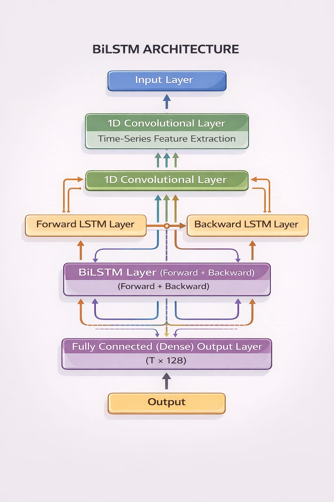
  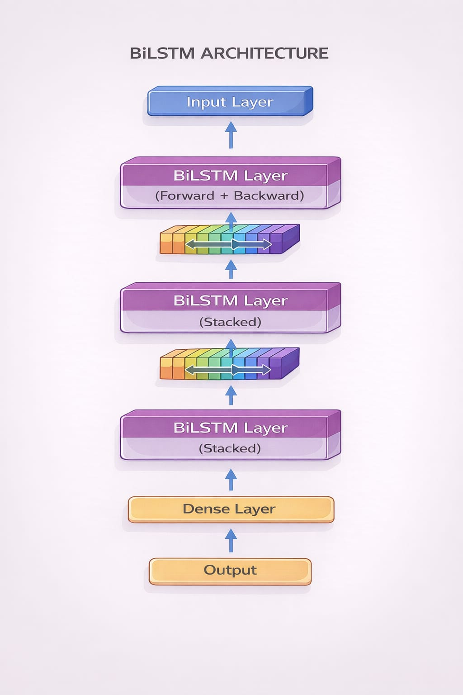


# 3️⃣ Attention Mechanism

The attention layer helps the model focus on the **most important time steps**.

### Alignment Score

$$
e_t = v^T \tanh(W_h h_t + b)
$$

### Attention Weights

$$
\alpha_t = \frac{exp(e_t)}{\sum_{i=1}^{T} exp(e_i)}
$$

### Context Vector

$$
c = \sum_{t=1}^{T} \alpha_t h_t
$$

The context vector represents a **weighted summary of the sequence**, focusing on important degradation patterns.

---

# 4️⃣ Fully Connected Layer (RUL Prediction)

The context vector from the attention layer is passed to a dense layer to predict RUL.

$$
RUL = Wc + b
$$

Where:

- $c$ = context vector  
- $W$ = weight matrix  
- $b$ = bias  

The output is the **predicted number of cycles remaining before engine failure**.

---

# 📊 Results and Discussion

<p align="center">
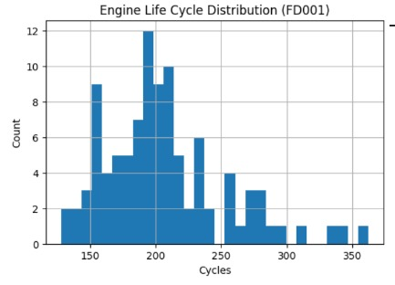
</p>

<p align="center">
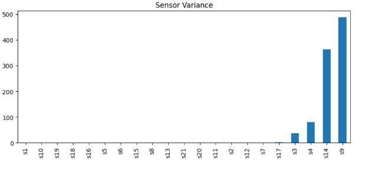
</p>

## Python Results

<p align="center">
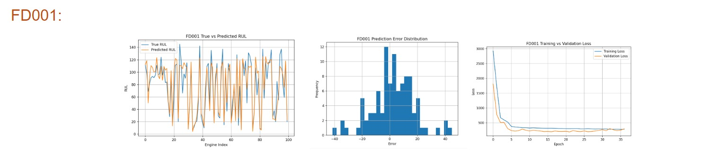
</p>

<p align="center">
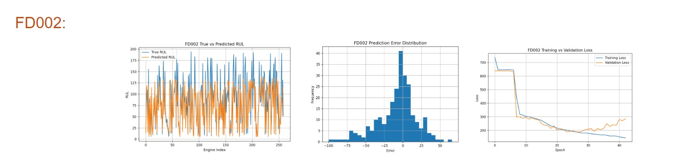
</p>

<p align="center">
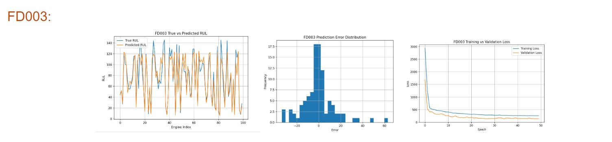
</p>

<p align="center">
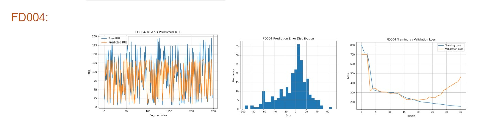
</p>

<p align="center">

</p>

<p align="center">

</p>

## MATLAB Results

<p align="center">

</p>

<p align="center">

</p>

<p align="center">
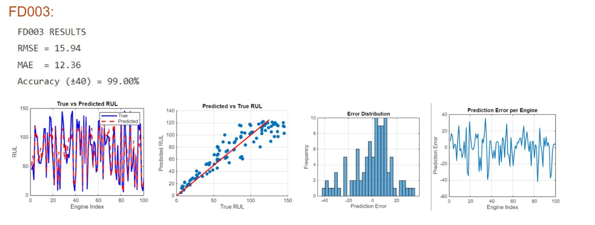
</p>

<p align="center">
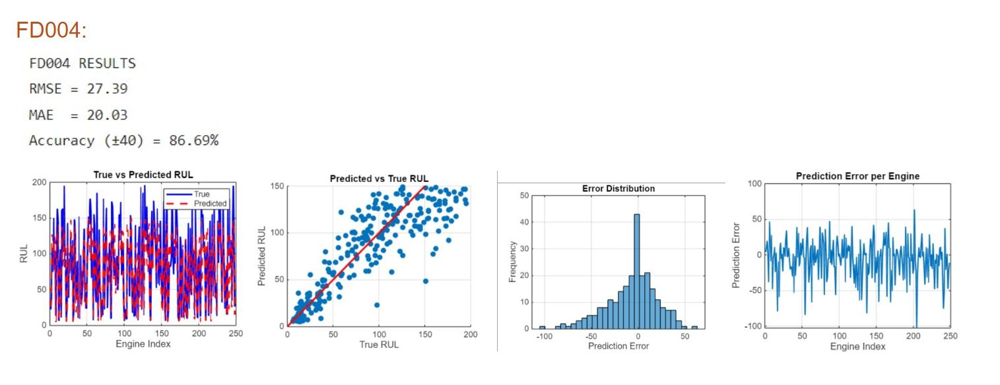
</p>

The proposed deep learning model shows strong performance in predicting Remaining Useful Life.

### Key Observations

- Predicted RUL values closely follow **true degradation trends**
- CNN captures **local sensor patterns**
- BiLSTM models **long-term dependencies**
- Attention improves **prediction accuracy and interpretability**

### Evaluation Metrics

- **RMSE** (Root Mean Square Error)
- **MAE** (Mean Absolute Error)
- **R² Score**

*(Detailed results and graphs will be added below.)*

---

# 🧠 PCA + SVR Model for Remaining Useful Life Prediction

This project implements a **Principal Component Analysis (PCA) + Support Vector Regression (SVR)** pipeline to predict the **Remaining Useful Life (RUL)** of aircraft engines using the **NASA C-MAPSS dataset**.

The pipeline converts raw multivariate sensor data into accurate RUL predictions using dimensionality reduction and regression modeling.

---

# ⚙️ Pipeline Overview

The pipeline runs identically for all four C-MAPSS datasets:

- **FD001**
- **FD002**
- **FD003**
- **FD004**

### Workflow

Sensor Data → Preprocessing → Sliding Window → PCA → SVR → RUL Prediction

The complete workflow contains **10 processing steps**:

1. Load raw dataset files  
2. Generate RUL labels  
3. Sensor selection  
4. Z-score standardization  
5. Sliding window feature creation  
6. Principal Component Analysis (PCA)  
7. Support Vector Regression (SVR) training  
8. Prediction and clipping  
9. Evaluation metrics  
10. Visualization of results  

---

# 📊 Dataset Description

Each row of the dataset contains **26 columns**.

| Column | Description |
|------|-------------|
| 1 | Engine Unit ID |
| 2 | Cycle Number |
| 3–5 | Operational Settings |
| 6–26 | Sensor Measurements (s1 – s21) |

Example structure:

```
EngineID  Cycle  Op1  Op2  Op3  s1 s2 s3 ... s21
```

---

# 🛠 RUL Label Generation

The **Remaining Useful Life (RUL)** is calculated using a **piecewise linear degradation model**.

### RUL Formula

```
RUL(t) = min(max_cycle_i − t , RUL_CAP)
```

Where:

- `max_cycle_i` = final cycle for engine *i*  
- `t` = current cycle  
- `RUL_CAP = 125`

### Example

| Cycle | RUL |
|------|-----|
| 1 | 125 |
| 75 | 125 |
| 76 | 124 |
| 150 | 50 |
| 200 | 0 |

This prevents unrealistic RUL values early in the engine life.

---

# 📉 Principal Component Analysis (PCA)

PCA reduces **high-dimensional sensor data** into a smaller set of informative features while preserving the majority of the variance.

### Dimensionality Reduction

```
420 Features
   ↓
PCA
   ↓
~40 Principal Components
```

This reduces noise and improves model training efficiency.

---

## Step 1 — Data Centering

The dataset must be centered before PCA.

### Mean Calculation

```
μ_j = (1/N) Σ X_ij
```

Centered matrix:

```
X_centered = X − μ
```

Centering ensures that PCA captures **true variance around the mean**.

---

## Step 2 — Covariance Matrix

The covariance matrix describes how features vary together.

### Formula

```
C = (1 / (N − 1)) * Xcᵀ Xc
```

Properties:

- Symmetric matrix  
- Eigenvalues ≥ 0  
- Captures correlation between sensors  

---

## Step 3 — Eigen Decomposition

PCA finds directions of maximum variance using eigenvectors.

### Eigenvalue Equation

```
C v = λ v
```

Where:

- `v` = eigenvector  
- `λ` = eigenvalue  

The covariance matrix can be decomposed as:

```
C = V D Vᵀ
```

- **V** → eigenvectors  
- **D** → eigenvalues  

---

## Step 4 — Explained Variance

Each eigenvalue represents the variance captured by that component.

### Explained Variance

```
Explained_i = (λ_i / Σλ) × 100%
```

Example:

| PC | Variance |
|----|---------|
| PC1 | 75.67% |
| PC2 | 20.26% |
| PC3 | 4.07% |

---

## Step 5 — Selecting Principal Components

Components are selected based on **cumulative explained variance**.

### Rule

```
k = min{ j : cumulative_variance ≥ 95% }
```

This ensures that **95% of the original information is retained**.

---

## Step 6 — Data Projection

After selecting the top components, the dataset is projected into the reduced feature space.

### Projection Formula

```
Z = X_centered · W
```

Where:

- `W` = selected eigenvectors  
- `Z` = reduced dimensional representation  

In the C-MAPSS dataset:

```
420 Dimensions → ~40 Principal Components
```

---

# 🤖 Support Vector Regression (SVR)

After PCA, the reduced features are used to train a **Support Vector Regression model**.

SVR learns a function that predicts Remaining Useful Life.

### SVR Objective

SVR tries to find a function:

```
f(x) = wᵀx + b
```

while minimizing prediction error within an **ε-insensitive region**.

---

### RBF Kernel

The model uses a **Radial Basis Function kernel**:

```
K(x_i , x_j) = exp(-γ ||x_i - x_j||²)
```

This allows SVR to capture **nonlinear relationships in engine degradation**.

---

# 📈 Results and Discussion

The PCA + SVR model demonstrates effective prediction of Remaining Useful Life for aircraft engines using multivariate sensor data.

Key findings include:

- PCA successfully reduces **420-dimensional sensor data to ~40 components**
- Dimensionality reduction improves **training stability and speed**
- SVR captures **nonlinear degradation patterns**
- The combined PCA + SVR pipeline provides **robust and stable predictions**

## FD001 Dataset Results

<p align="center">
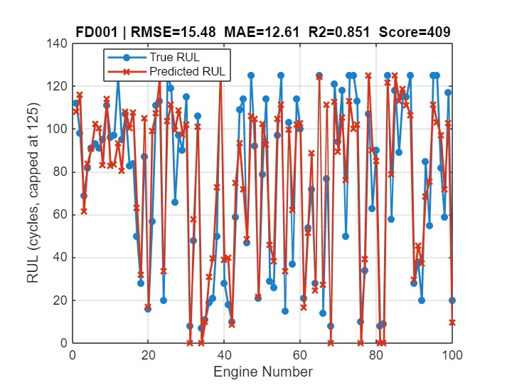
</p>

<p align="center">
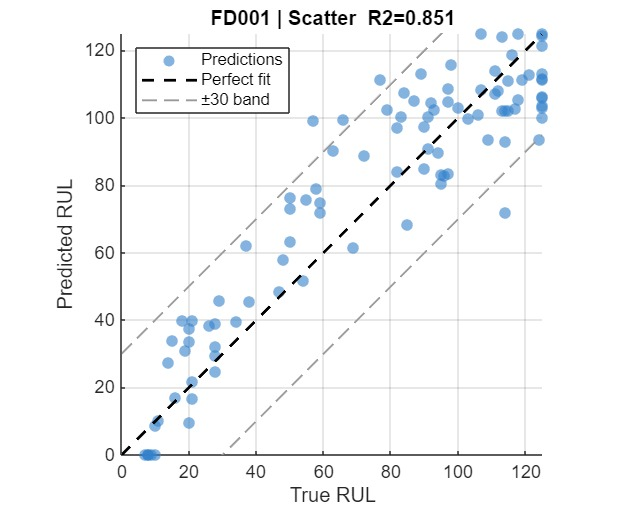
</p>

<p align="center">
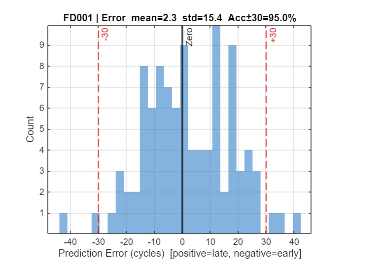
</p>

---

## FD002 Dataset Results

<p align="center">
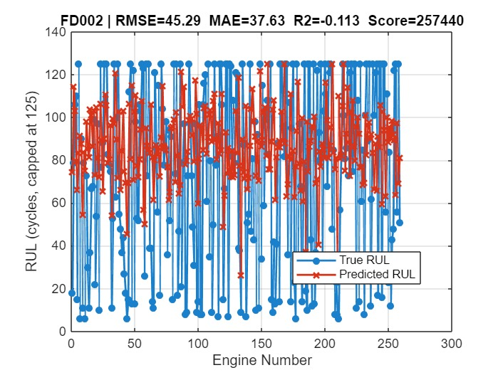
</p>

<p align="center">
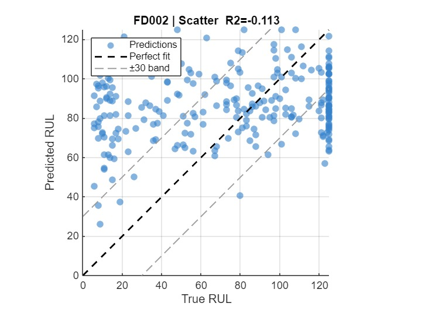
</p>

<p align="center">
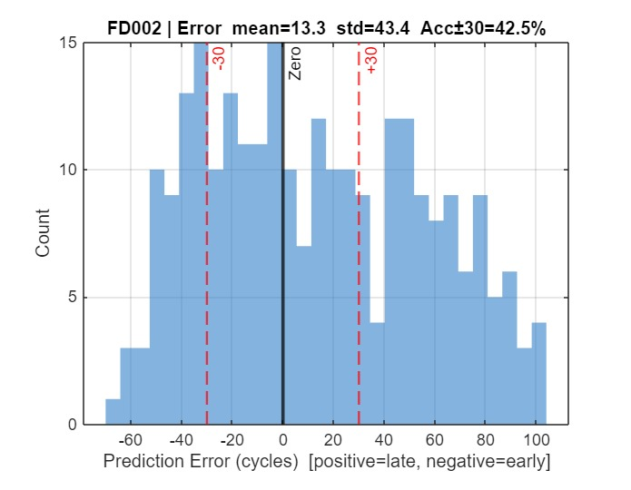
</p>

---

## FD003 Dataset Results

<p align="center">
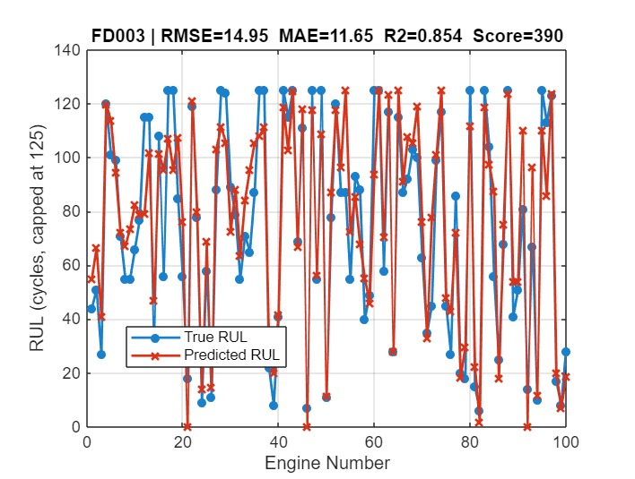
</p>

<p align="center">
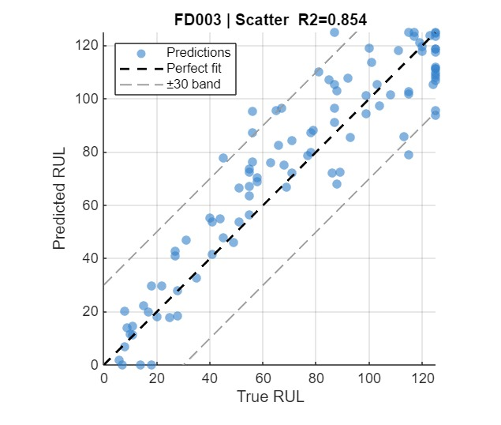
</p>

<p align="center">
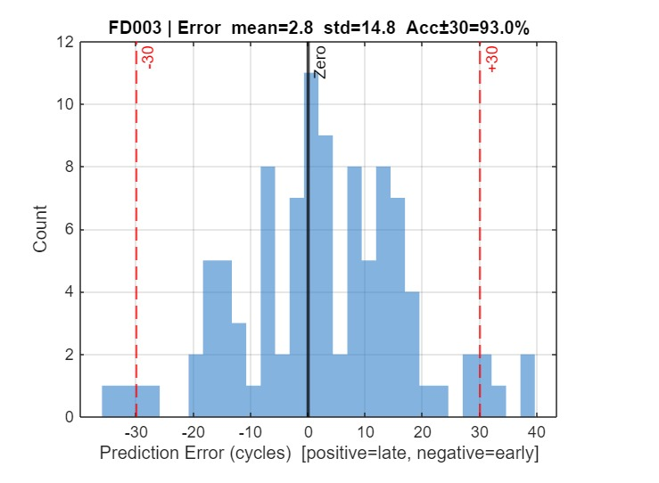
</p>

---

## FD004 Dataset Results

<p align="center">
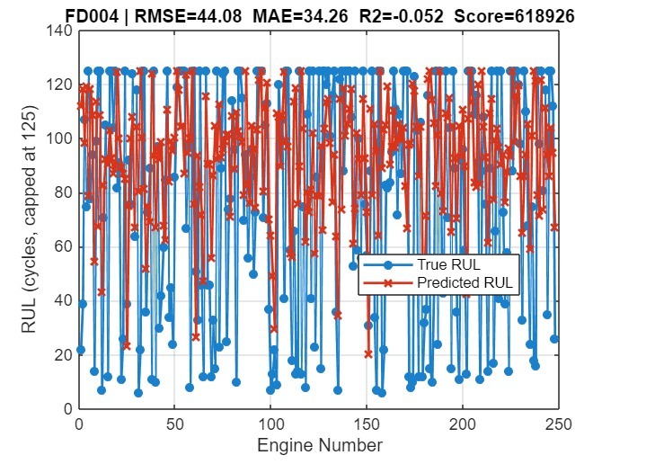
</p>

<p align="center">
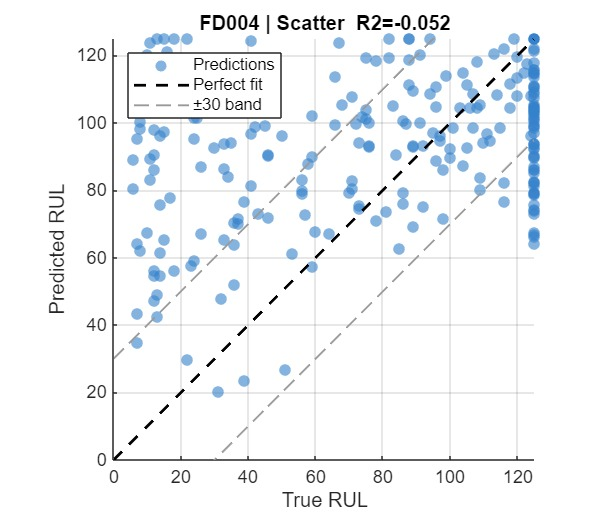
</p>

<p align="center">
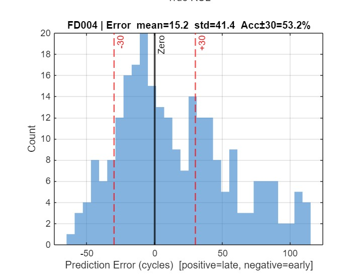
</p>

---

### Key Observations

- PCA successfully reduces **high-dimensional sensor data**
- SVR captures **nonlinear degradation patterns**
- Predictions follow the **true RUL degradation trend**
- The model generalizes across **all four C-MAPSS datasets**

---

# 📊 Evaluation Metrics

The model performance is evaluated using:

### RMSE

```
RMSE = sqrt( (1/n) Σ (y_pred − y_true)² )
```

### MAE

```
MAE = (1/n) Σ |y_pred − y_true|
```

### R² Score

```
R² = 1 − (SS_res / SS_tot)
```

Additional evaluation measures may include:

- **NASA Score**
- **Accuracy within ±30 cycles**


---
## Execution Time and Platform

Platform Used: Personal Laptop  
Hardware: Intel i7 CPU, 16GB RAM  
Programming Language: MATLAB

Execution time was measured using MATLAB tic and toc commands.

Total execution time (FD001–FD004 combined): 132.48 seconds.

## Execution Time and Platform

Platform Used: Personal Laptop
Hardware: CPU (Intel i5 / i7)
Programming Language: Python

Total execution time: ~145 seconds

# 🔮 Future Plans

Future improvements include:

- Deploying the system for **real aircraft maintenance environments**
- Extending the approach to other systems such as:
  - Wind turbines
  - Industrial machinery
  - Electric vehicle batteries
- Studying robustness under **noisy sensor conditions**
- Developing a **lightweight real-time monitoring system**

---

# 📚 References

Saxena, A., Goebel, K., Simon, D., & Eklund, N. (2008).  
Damage propagation modeling for aircraft engine run-to-failure simulation.  
NASA Ames Research Center.

https://ti.arc.nasa.gov/tech/dash/groups/pcoe/prognostic-data-repository/

Dida, M., Cheriet, A., & Belhadj, M. (2025).  
Remaining Useful Life Prediction Using Attention-LSTM Neural Network of Aircraft Engines.  
International Journal of Prognostics and Health Management.

https://www.phmpapers.org

Ferreira, L., & Gonçalves, R. (2022).  
Remaining Useful Life Estimation Using Deep Learning and the NASA C-MAPSS Dataset.  
Scientific Reports, Springer Nature.

https://www.nature.com
